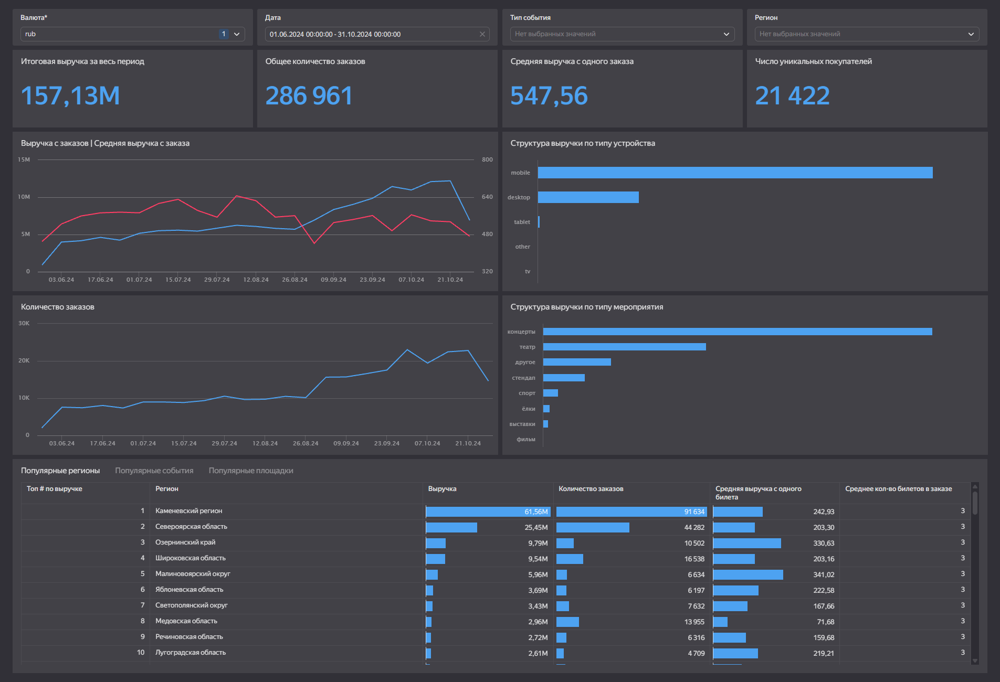

## 🔗 Live Dashboard
https://datalens.yandex/i96kvymtwxlw2

---

---

## 📌 Introduction

This dashboard analyzes sales performance of the **Afisha** service and evaluates:

- Revenue dynamics  
- Order structure  
- User behavior  

Key analytical dimensions:
- Time  
- Event type  
- Region  
- Device type  
- Venue  

---

## 1️⃣ Data Overview

The analysis is based on Afisha ticket order data.  
The dashboard aggregates core sales and user metrics across key business dimensions.

All conclusions below are based on **RUB (Russian Ruble)** transactions because:

- Orders in KZT represent a minor share of total volume  
- KZT transactions contain outliers that require separate analysis  

---

## 2️⃣ Key Aggregated Metrics

- **Total Revenue:** 157.13M ₽  
- **Total Orders:** 286,961  
- **Average Order Value (AOV):** 547.56 ₽  
- **Unique Buyers:** 21,422  

Customer repeat behavior is strong:

> Average number of orders per user exceeds 13, indicating high loyalty and recurring content consumption.

---

## 3️⃣ Time Dynamics

- Revenue and order volume grow steadily from June to October  
- Noticeable acceleration occurs in early autumn  
- Peak activity: September–October  
- Slight decline after peak  

AOV fluctuates between 450–650 ₽ without sharp spikes, suggesting stable pricing.

**Revenue growth driver:**  
Increase in order volume rather than increase in AOV.

---

## 4️⃣ Revenue Structure by Event Type

- **Concerts** — dominant revenue segment  
- **Theater** — second place with significant gap  
- "Other" and Stand-up — mid-tier  
- Sports, exhibitions, films — minor share  

**Conclusion:**  
The business is highly dependent on the concert segment. Diversification across event types is limited.

---

## 5️⃣ Revenue Structure by Device

- **Mobile** — dominant sales channel  
- Desktop — secondary but significant  
- Tablet / TV / Other — negligible impact  

This indicates strong reliance on mobile UX and mobile acquisition channels.

---

## 6️⃣ Regional Distribution

- Top region generates >60M ₽, significantly ahead of others  
- Revenue distribution is highly skewed  
- A few leading regions drive most revenue, followed by a long tail  

Average tickets per order are stable across regions (=3).  
Revenue differences are mainly driven by order volume and ticket pricing.

---

## 7️⃣ Venues & Events

Top venues show similar order volumes but significant differences in average ticket revenue.

Possible drivers:
- Pricing strategy  
- Event type mix  
- Audience purchasing power  

---

## 8️⃣ Key Business Conclusions

- Revenue growth is volume-driven, not price-driven  
- Concerts are the primary business driver  
- Mobile is the dominant sales channel  
- Revenue distribution across regions is highly asymmetric  

### Potential Growth Areas:

- Development of underrepresented event types  
- Strengthening second-tier regions  
- Mobile user journey optimization  

---

## 🔗 Live Dashboard
https://datalens.yandex/i96kvymtwxlw2
